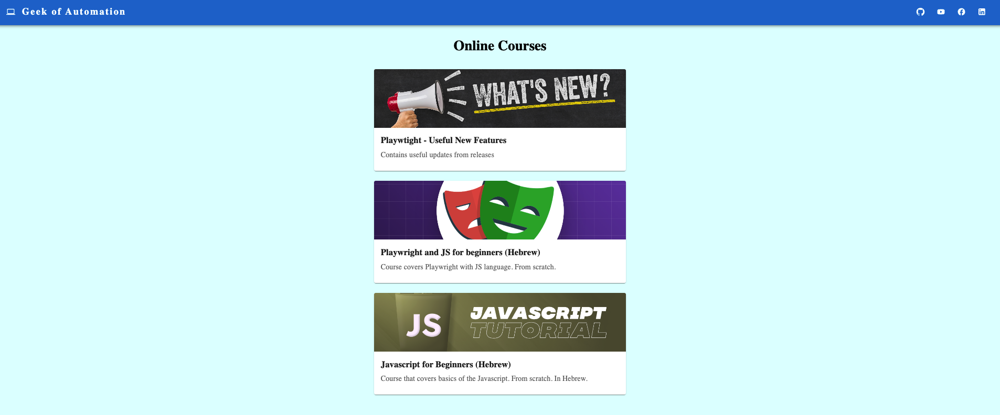

# Online Courses App

This project was bootstrapped with [Create React App](https://github.com/facebook/create-react-app).

## Application 
[Demo of application](https://geek-of-automation.onrender.com/)

## DB 
- [Amazon DynamoDB](https://aws.amazon.com/dynamodb/)
## Libraries
- [react](https://reactjs.org/)
- [react-router-dom](https://reactrouter.com/en/main)
- [material ui](https://mui.com/)
- [firebase](https://console.firebase.google.com/)

## Quick Description

The application contains online free courses. 

## Contact Details
[Linkedin](https://www.linkedin.com/in/alexander-komanov-88b138158/)

[Facebook](https://www.facebook.com/akomanov/)

[YouTube](https://www.youtube.com/@geekofautomation8953)

Feel free to use!